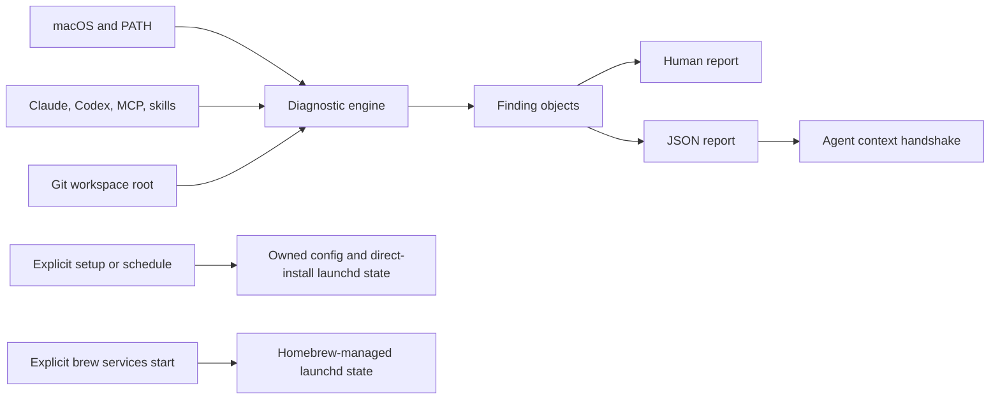

# Architecture

AI Environment Optimizer is deliberately smaller than an agent framework or package
manager. It observes existing tools and mutates only its own state.

## Runtime

The CLI uses the Ruby standard library and supports the macOS system Ruby 2.6.
External commands run as argument arrays with timeouts. Results retain the
executable basename and exit metadata; arguments are not serialized.

## Finding contract

Each finding has a stable ID, category, status, message, optional detail and
remediation, required flag, affected component list, and public reference
links. Human and JSON output render the same ordered finding collection.

Statuses are `pass`, `warn`, `fail`, `info`, `skip`, and `unknown`.
Required `fail` or `unknown` findings exit 1. A top-level internal failure
exits 3.

## Agent context

`agent-context` runs the doctor and workspace scanner over one read-only check
context. It embeds both redacted reports in a single JSON document, deduplicates
actionable findings, assigns deterministic P0/P1/P2 priorities, and includes a
static authorization and verification contract for Codex and Claude Code. It
does not infer repair commands or introduce another mutation path.

## Ownership

For a new installation, configuration and reports live under
`~/Library/Application Support/io.github.nyldn.ai-env-optimizer`. An existing
v0.1 installation keeps using its owned
`~/Library/Application Support/io.github.nyldn.ai-optimizer` directory so a
read-only command never moves state as a side effect. The direct-install
scheduler uses the exact label `io.github.nyldn.ai-optimizer.daily`. Writes
reject symlink targets, stage and validate before rename, and record product
provenance.

Homebrew installations can instead opt into the formula service, whose exact
label is `homebrew.mxcl.ai-optimizer`. Its command resolves through Homebrew's
stable `opt` path and its 19:30 schedule is generated by Homebrew's public
service DSL. The direct scheduler uses `launchctl bootstrap`, `bootout`, and
`print` in the current user's GUI domain. Neither path writes a user crontab.

The old labels are stable internal compatibility identifiers, not the public
product name. Keeping them prevents duplicate launchd jobs during the v0.2
rename. The canonical CLI is `ai-env-optimizer`; `ai-optimizer` is shipped as a
compatibility alias. Canonical `AI_ENV_OPTIMIZER_*` environment variables take
precedence over supported legacy `AI_OPTIMIZER_*` variables.
