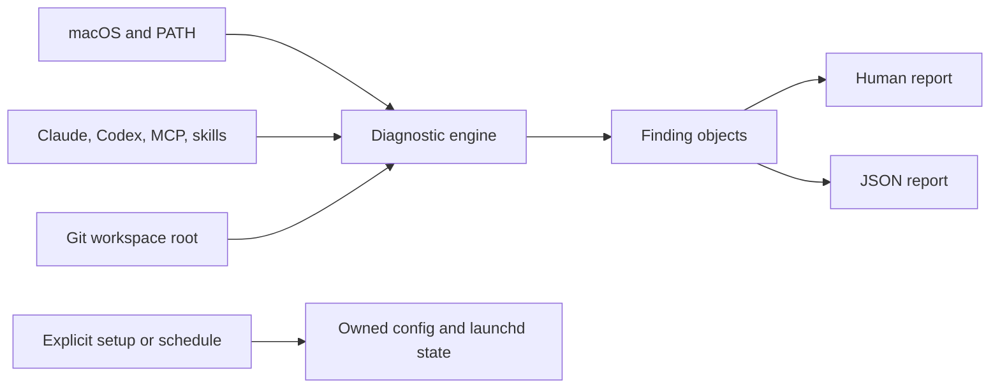

# Architecture

AI Optimizer is deliberately smaller than an agent framework or package
manager. It observes existing tools and mutates only its own state.

## Runtime

The CLI uses the Ruby standard library and supports the macOS system Ruby 2.6.
External commands run as argument arrays with timeouts. Results retain the
executable basename and exit metadata; arguments are not serialized.

## Finding contract

Each finding has a stable ID, category, status, message, optional detail and
remediation, required flag, affected component list, and public reference
links. Human and JSON output render the same ordered finding collection.

Statuses are `pass`, `warn`, `fail`, `info`, `skip`, and `unknown`.
Required `fail` or `unknown` findings exit 1. A top-level internal failure
exits 3.

## Ownership

Configuration and reports live under
`~/Library/Application Support/ai-optimizer`. User automation is the exact
label `io.github.nyldn.ai-optimizer.daily`. Writes reject symlink targets,
stage and validate before rename, and record product provenance.

The launch agent uses `launchctl bootstrap`, `bootout`, and `print` in the
current user's GUI domain. It never uses cron.
